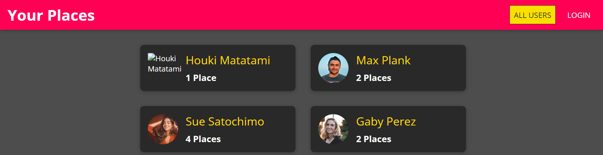

# zuixihuandifang

Full stack MERN project

<a href="">Live preview</a>

Project scope: This project is inspired by Maximilian MERN udemy course on .
It's about a simple app that allows users to signup, login, upload info, inclusing an image, about places they like or have visited, edit those info later on or simply delete a place from their profile.
The whole thing was eventually deployed as a combined app.

Tech Stack: 
back end: node/express + mongodb
front end: react 

Key learning points:
- the MVC folder structure
- how to use multer for file uploads
- how to connect to mongodb using mongoose
- how to handle authentication and authorization and persist it across the app
- how to combine frontend with backend for a combined deployment.
- how to switch between login and signup form in the same component
- how to use some react hooks like useCallback
- how to fetch data from the backend with proper settings for the headers and body
